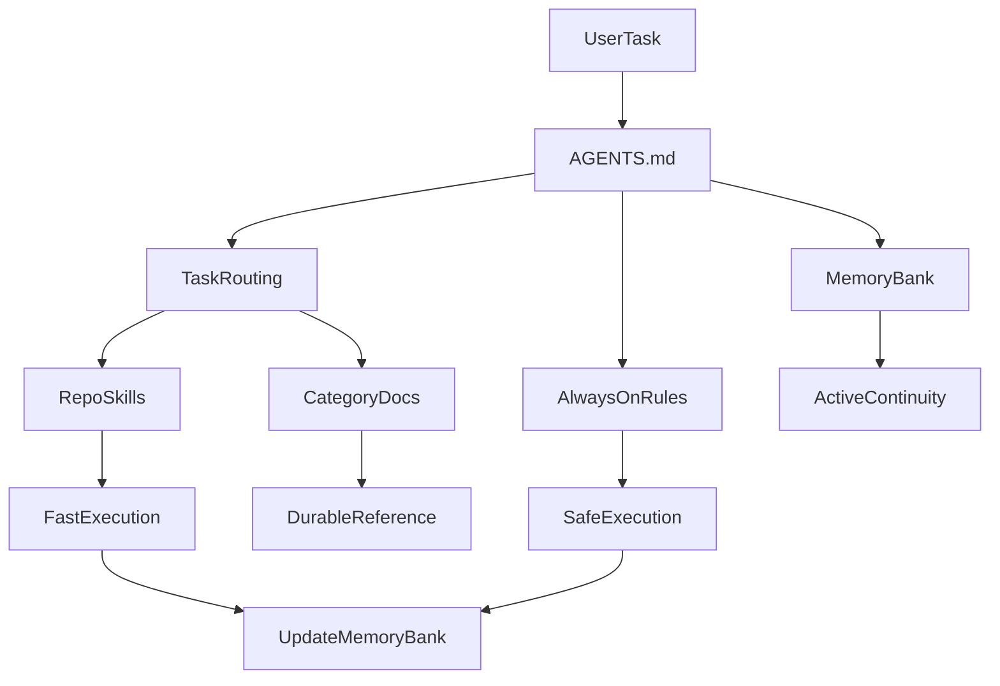

# Final Turbo Plan — Maximize Agent Effectiveness

## Executive Decision

Adopt a repo operating system with five layers and one clear execution loop: `AGENTS.md` starts the task, `.cursor/rules/*` prevents expensive mistakes, `memory-bank/*` holds active repo memory, category-based `docs/*` holds durable reference material, and `.agents/skills/*` executes repeated workflows faster than rediscovery. Keep always-on context compact. Move durable knowledge out of `docs/agent/*`. Treat `memory-bank/*` as mandatory working state, not optional documentation.

## Final Design Principles

- Keep startup context short, operational, and stable.
- Keep always-on rules to three files only.
- Put active working memory in `memory-bank/*`.
- Put durable reference knowledge in category-based `docs/*`.
- Make skills short, procedural, and output-driven.
- Treat repo root as canonical and `.runtime-wp` as runtime mirror only.
- Require evidence for verification and runtime claims.
- Escalate contract and integration changes explicitly.
- Delete or simplify any layer that duplicates another layer.

## Operating Flow



## Final File Architecture

```text
kalk-top/
├── AGENTS.md
├── RULES.md
├── memory-bank/
│   ├── project-brief.md
│   ├── current-state.md
│   ├── active-context.md
│   ├── decisions.md
│   ├── progress.md
│   └── open-questions.md
├── .cursor/
│   ├── rules/
│   │   ├── 00-topinstal-ecosystem-constitution.mdc
│   │   ├── 10-repo-role.mdc
│   │   └── 20-execution-protocol.mdc
│   └── plans/
├── docs/
│   ├── architecture/
│   │   └── repo-rules.md
│   ├── discovery/
│   │   └── repo-discovery.md
│   ├── contracts/
│   │   ├── field-mapping.md
│   │   └── dto-and-boundaries.md
│   ├── plans/
│   │   └── migration-plan.md
│   ├── runbooks/
│   │   └── manual-runtime-setup.md
│   ├── tooling/
│   │   └── mermaid-preview.md
│   └── ecosystem/
│       ├── TOPINSTAL_ECOSYSTEM_STATE.md
│       ├── TOPINSTAL_ECOSYSTEM_RULES_DESIGN.md
│       ├── TOPINSTAL_ECOSYSTEM_UPDATE_PROTOCOL.md
│       ├── TOPINSTAL_ECOSYSTEM_TASK_RESPONSE_FORMAT.md
│       └── templates/
├── .agents/
│   └── skills/
│       ├── kalk-top-contract-impact-check/
│       │   └── SKILL.md
│       ├── kalk-top-repo-discovery-map/
│       │   └── SKILL.md
│       ├── kalk-top-wp-runtime-verifier/
│       │   └── SKILL.md
│       └── kalk-top-calculator-form-flow-tracer/
│           └── SKILL.md
└── .runtime-wp/
```

## Role of Each Layer

`AGENTS.md`

- Startup operator guide.
- Defines repo identity, read order, routing hints, canonical-vs-runtime warning, post-task update obligations, and cross-repo escalation triggers.
- Must stay short enough to scan quickly.

`RULES.md`

- Compatibility pointer only.
- Points to `docs/architecture/repo-rules.md`.
- Must not contain active workflow or deep guidance.

`.cursor/rules/*`

- Always-on guardrails only.
- `00` protects ecosystem ownership and cross-repo responsibility.
- `10` protects repo role and local architectural boundaries.
- `20` protects execution discipline: workspace safety, verification-before-claim, evidence, contract escalation, canonical-vs-runtime handling.

`memory-bank/*`

- Active repo memory for continuity across tasks.
- Used before meaningful work and updated after meaningful work.
- Stores what the agent should currently know, not long-term architecture essays.

`docs/*`

- Durable reference material.
- Category-based, not task-bucketed.
- Used on demand after startup routing.

`.agents/skills/*`

- Fast execution aids for repeated workflows.
- Must reduce rediscovery or execution time.
- Must remain short, procedural, and output-driven.

## Approved Phases

### Phase 0: Memory Bank

Create `memory-bank/*` as a mandatory layer.

Files:

- `project-brief.md`: stable repo mission, primary system boundary, repo role, non-negotiable invariants.
- `current-state.md`: current architecture truth, active seams, canonical flows, current technical reality.
- `active-context.md`: current task focus, touched areas, live assumptions, verification target, current risks.
- `decisions.md`: durable decisions with date, rationale, and impact.
- `progress.md`: completed steps, last verified outcomes, next pending actions.
- `open-questions.md`: unresolved ambiguity, blockers, missing evidence, pending confirmations.

Read before meaningful work:

- `project-brief.md`
- `current-state.md`
- `active-context.md`

Update after meaningful work:

- `active-context.md`
- `progress.md`

Update when applicable:

- `decisions.md`
- `open-questions.md`
- `current-state.md`

Update frequency:

- Stable: `project-brief.md`
- Semi-stable: `current-state.md`, `decisions.md`
- Frequently changing: `active-context.md`, `progress.md`, `open-questions.md`

### Phase 1: AGENTS.md

Rewrite `AGENTS.md` as a short operator guide.

Must include:

- repo identity
- primary technical goal
- startup read order
- routing hints by task type
- canonical-vs-runtime warning
- post-task memory-bank update obligations
- explicit cross-repo escalation triggers
- verification defaults by change type

Must not include:

- long architecture prose
- detailed migration narrative
- duplicated rules content

### Phase 2: Compact Always-On Rules

Keep only:

- `00-topinstal-ecosystem-constitution.mdc`
- `10-repo-role.mdc`
- `20-execution-protocol.mdc`

`20-execution-protocol.mdc` must absorb:

- repo root is canonical
- `.runtime-wp` is not for default editing
- prefer canonical docs over pointer files
- read memory bank before meaningful work
- verify changed behavior before claiming success
- include evidence of what was run
- escalate DTO, REST, auth, trace, generator, and mail-ingress changes
- require explicit impact-check outcome
- update memory bank after meaningful work

### Phase 3: Category-Based Docs

Approved path: move now to category-based docs.

Immediate action:

- create `docs/architecture/*`, `docs/discovery/*`, `docs/contracts/*`, `docs/plans/*`, `docs/runbooks/*`, `docs/tooling/*`
- move canonical content out of `docs/agent/*`
- add temporary pointers only where migration safety requires them

Transitional rule:

- `docs/agent/*` may exist only as short migration pointers

Long-term target:

- remove `docs/agent/*` completely

### Phase 4: Procedural Skills

Implement first-wave skills only:

- `kalk-top-contract-impact-check`
- `kalk-top-repo-discovery-map`
- `kalk-top-wp-runtime-verifier`
- `kalk-top-calculator-form-flow-tracer`

Defer second-wave skills until first-wave usefulness is proven in real tasks:

- `kalk-top-mail-ingress-triage`
- `kalk-top-harness-and-fixture-regression`

### Phase 5: Validation and Pruning

After implementation:

- remove duplicated instructions across all layers
- shorten any skill that reads like documentation
- remove dead pointers
- delete any skill that does not measurably reduce rediscovery or execution time

## Required File-Level Changes

`AGENTS.md`

- Replace index-heavy structure with short startup operator guide.
- Add startup read order:
  - `memory-bank/project-brief.md`
  - `memory-bank/current-state.md`
  - `memory-bank/active-context.md`
- Add routing:
  - bugfix/refactor -> `docs/architecture/repo-rules.md` + relevant skill if needed
  - contract/DTO/REST change -> `docs/contracts/*` + ecosystem docs + contract-impact skill
  - runtime/setup issue -> `docs/runbooks/manual-runtime-setup.md` + runtime verifier
  - calculator/form flow issue -> `docs/contracts/field-mapping.md` + `docs/discovery/repo-discovery.md` + form-flow tracer
  - mail-ingress/integration issue -> ecosystem docs + discovery docs + runtime verifier
- Add warning that `.runtime-wp` is not canonical for edits.
- Add obligation to update `memory-bank/active-context.md` and `memory-bank/progress.md` after meaningful work.
- Add obligation to escalate cross-repo impact when touching contracts or integrations.

`RULES.md`

- Keep as pointer only.
- Point to `docs/architecture/repo-rules.md`.
- Remove any active execution or migration guidance.

`.cursor/rules/00-topinstal-ecosystem-constitution.mdc`

- Keep only ecosystem ownership, role boundaries, and cross-repo contract responsibility.
- Add frontmatter if missing.
- Remove execution-protocol details.

`.cursor/rules/10-repo-role.mdc`

- Keep only repo role, decision-layer identity, local boundaries, and canonical docs reference.
- Add frontmatter if missing.
- Do not duplicate execution protocol or memory bank behavior.

`.cursor/rules/20-execution-protocol.mdc`

- Create this file.
- Include:
  - canonical workspace rule
  - `.runtime-wp` mirror warning
  - mandatory memory-bank read-before-work rule
  - verification-before-claim rule
  - evidence rule
  - contract escalation rule
  - canonical-docs-over-pointers rule
  - post-task memory-bank update rule
- Keep it compact.

`docs/*`

- Move canonical architecture guidance to `docs/architecture/repo-rules.md`.
- Move discovery guidance to `docs/discovery/repo-discovery.md`.
- Move mapping and boundary material to `docs/contracts/field-mapping.md` and `docs/contracts/dto-and-boundaries.md`.
- Move roadmap material to `docs/plans/migration-plan.md`.
- Keep runtime setup in `docs/runbooks/manual-runtime-setup.md`.
- Keep tooling-only guidance in `docs/tooling/*`.
- Keep `docs/ecosystem/*` as cross-repo reference layer.
- Reduce `docs/agent/*` to temporary pointers only, then remove them.

`memory-bank/*`

- Create all six files.
- Seed them with concise content and explicit update rules.
- Keep them short, current, and operational.
- Use `active-context.md` and `progress.md` as mandatory post-task update targets.
- Use `open-questions.md` as the ambiguity register.

`.agents/skills/*`

- Create exactly four first-wave skills.
- Keep each short enough to scan in under one minute.
- Require each skill to define:
  - when to use
  - exact inputs
  - first files/docs to read
  - preferred tools
  - invariants to check
  - exact output format
  - failure/uncertainty handling

## Skill Design Standard

Every repo skill must follow this standard:

- Scope: one workflow only.
- Length: scannable in under one minute.
- Trigger: explicit task types or phrases.
- Inputs: exact required inputs only.
- First reads: exact files to inspect first.
- Tools: preferred tools and avoided patterns.
- Invariants: checks that must pass before concluding.
- Output: strict structured output shape.
- Failure mode: explicit stop condition and uncertainty handling.
- Removal rule: remove or simplify if it does not save time.

First-wave standards:

`kalk-top-contract-impact-check`

- Use when touching `CalcRequestDTO`, `OfferDTO`, REST routes, auth, trace, generator, or mail-ingress integration.
- Inputs: changed files, proposed contract change, user goal.
- First reads: `AGENTS.md`, `memory-bank/current-state.md`, `docs/contracts/*`, `docs/ecosystem/TOPINSTAL_ECOSYSTEM_STATE.md`, `docs/ecosystem/TOPINSTAL_ECOSYSTEM_UPDATE_PROTOCOL.md`.
- Preferred tools: targeted search and focused file reading.
- Invariants: producer-consumer map, downstream repos named, docs-update decision made.
- Output: `scope`, `affected-boundaries`, `downstream-impact`, `docs-update-required`, `open-risks`.
- Failure handling: stop and register uncertainty in `memory-bank/open-questions.md`.

`kalk-top-repo-discovery-map`

- Use when starting unfamiliar work.
- Inputs: task summary, touched area, optional symptom.
- First reads: `AGENTS.md`, `memory-bank/project-brief.md`, `memory-bank/current-state.md`, `docs/discovery/repo-discovery.md`.
- Preferred tools: focused search and targeted reading.
- Invariants: source of truth identified, likely edit points listed, verification path named.
- Output: `source-of-truth`, `likely-edit-points`, `forbidden-layers`, `verify-next`.
- Failure handling: escalate if ownership is unclear.

`kalk-top-wp-runtime-verifier`

- Use for runtime wiring, preflight, route, auth, or environment issues.
- Inputs: base URL, route, environment, available auth material, symptom.
- First reads: `AGENTS.md`, `memory-bank/current-state.md`, `docs/runbooks/manual-runtime-setup.md`, relevant REST adapters.
- Preferred tools: targeted harnesses, safe runtime checks, browser/runtime inspection when needed.
- Invariants: route exists, auth path understood, something was actually run, result classified.
- Output: `checked`, `ran`, `evidence`, `classification`, `next-action`.
- Failure handling: stop if access or credentials are missing and say exactly what is missing.

`kalk-top-calculator-form-flow-tracer`

- Use for field gating, UI state, mapping, or frontend/backend truth conflicts.
- Inputs: symptom, field or screen, optional payload or traceId.
- First reads: `AGENTS.md`, `memory-bank/current-state.md`, `docs/contracts/field-mapping.md`, `docs/discovery/repo-discovery.md`.
- Preferred tools: targeted tracing across form, mapper, backend use case, and results renderer.
- Invariants: source of truth identified, gating path traced, authority stated.
- Output: `symptom`, `trace-path`, `source-of-truth`, `breakpoint`, `verify-next`.
- Failure handling: explicitly preserve legacy-vs-backend conflict if unresolved.

## Delivery Order

1. Create `memory-bank/*`.
2. Rewrite `AGENTS.md`.
3. Add or normalize frontmatter in `00` and `10`, then create `20-execution-protocol.mdc`.
4. Move canonical docs into category-based `docs/*`.
5. Reduce `docs/agent/*` to pointers.
6. Create the four first-wave skills.
7. Run validation and prune duplication.

## Measurable Success Criteria

- The agent does not edit `.runtime-wp` unless explicitly asked.
- The agent reads `memory-bank/project-brief.md`, `current-state.md`, and `active-context.md` before meaningful work.
- The agent updates `memory-bank/active-context.md` and `memory-bank/progress.md` after meaningful work.
- The agent updates `memory-bank/open-questions.md` when ambiguity blocks safe progress.
- Every DTO, REST, auth, trace, generator, or mail-ingress change produces an explicit impact-check outcome.
- Every runtime-related claim includes evidence of what was actually run.
- `AGENTS.md` stays short and operational.
- `.cursor/rules/` contains exactly three always-on files.
- Canonical docs live in category-based `docs/*`.
- `docs/agent/*` does not remain a canonical knowledge bucket.
- The four first-wave workflows are handled by skills instead of fresh rediscovery.
- Any skill that does not save time is simplified or removed.

## Deferred / Transitional Items

- `docs/agent/*` may temporarily exist as migration pointers only.
- `RULES.md` remains a compatibility pointer only.
- Second-wave skills remain deferred until first-wave usefulness is proven.

## Final Recommendation

Implement this turbo-plan exactly. The upgrade is not “more docs”; it is a tighter repo operating model: short startup guidance, three compact always-on rules, mandatory working memory, category-based canonical docs, and four procedural skills that make the agent faster and safer on real repo tasks.
