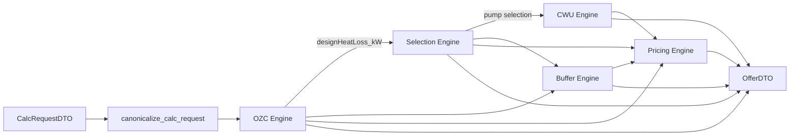

# Engine Knowledge Graphs

> Status: operational
> Owner: TOP-INSTAL engineering / calculation core
> Last verified against code/runtime: 2026-05-20
> Source-of-truth level: L2
> Supersedes: none
> Related docs: `docs/SOURCE_OF_TRUTH_INDEX.md`, `docs/contracts/dto-and-boundaries.md`, `core/application/CalculateOfferUseCase.php`, `core/domain/*/*Engine.php`

## Purpose

This folder is the repo-local companion to the GitNexus MCP graph. The project is indexed as `kalk-top` (8615 nodes / 15106 edges as of 2026-05-20, after `--force` rebuild). Markdown diagrams stay human-readable; `engine-graphs.json` carries domain graphs plus a `gitnexus.*` traceability block (class UIDs, CALLS edges, orchestration) exported via MCP `context` / `cypher`.

Re-index when code changes materially:

```bash
cd c:\Users\compg\Desktop\kalk-top
npx gitnexus analyze --name kalk-top --skip-git
```

(`--skip-git` is required here because this workspace folder is not a git root.)

Each graph separates three concerns:

- knowledge graph: concepts and domain decisions owned by the engine,
- dependency graph: code/data/runtime inputs and downstream consumers,
- calculation graph: ordered formulas and transformations.

## Files

- `ozc.graph.md` - design heat loss, annual energy estimate, costs/explainability side outputs.
- `selection.graph.md` - pump matching and AIO/split selection.
- `cwu.graph.md` - domestic hot water demand, tank capacity, annual DHW energy.
- `buffer.graph.md` - hydraulic separation/storage/anti-cycling sizing.
- `pricing.graph.md` - backend pricebook resolution and item totals.
- `engine-graphs.json` - machine-readable combined graph.

## System-Level Flow



## Current Critical Audit Note

The OZC graph currently contains the highest-risk realism drift: old windows, recovery ventilation, doors, and basement are already represented in the physical `U * A * deltaT` / ventilation model, then adjusted again by additive kW corrections.

- Method audit: `docs/architecture/ozc-professional-method-audit.md`
- Cross-engine defect register (GitNexus + harnesses, 2026-05-20): `docs/architecture/engine-calculation-detective-report-2026-05-20.md`
