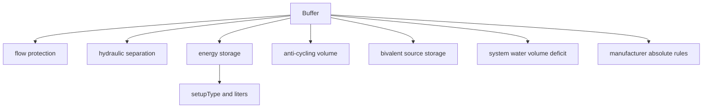
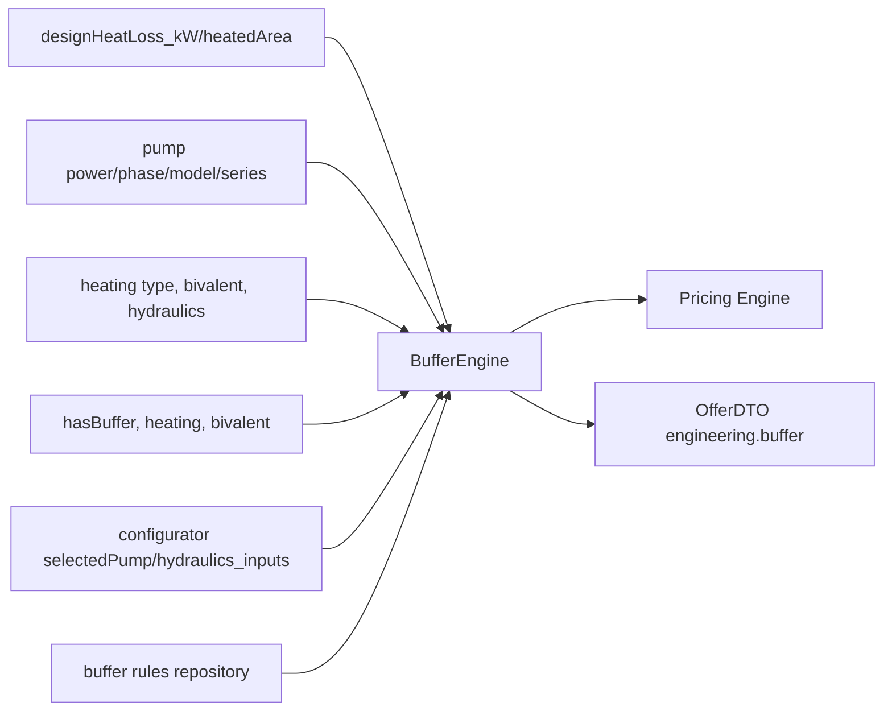

# Buffer Engine Graph

> Status: operational audit graph
> Owner: `core/domain/buffer/BufferEngine.php`
> Last verified against code/runtime: 2026-05-20 (GitNexus MCP)
> Source-of-truth level: L2
> GitNexus: `Class:core/domain/buffer/BufferEngine.php:TopInstal_BufferEngine` · entry `computeBuffer` · variants `_Full` / `_Mvp`

## Knowledge Graph



## Dependency Graph



## Calculation Graph

```mermaid
flowchart TD
  Start[input] --> Normalize[normalize emitter/hydraulics]
  Normalize --> Pump[pump power and min modulation]
  Pump --> Anti[V_anti = P_min * t / (c_w * dT) * 1000]
  Normalize --> Volume[estimated system volume]
  Pump --> Required[required water volume = pump_power * liters_per_kW]
  Required --> Deficit[max(required, anti) - estimated]
  Start --> Biv[V_bivalent by secondary source]
  Normalize --> Axes[flow/separation/storage axes]
  Deficit --> Sizing[max anti, bivalent, hydraulic]
  Biv --> Sizing
  Axes --> InternalRec[internal recommendation]
  InternalRec --> Round[round to market capacity]
  Round --> Manufacturer[apply manufacturer minimum]
  Manufacturer --> Output[buffer result]
```

## Current Notes

- Buffer sizing is downstream of both OZC and selection. If OZC is high, selected pump and anti-cycling capacity can increase.
- The final liter value is `max(V_antiCycling, V_bivalent, V_hydraulic)` rounded to available market capacities plus manufacturer minimums.
- GitNexus: `CalculateOfferUseCase.execute` → `computeBuffer` (CALLS). Regression: `buffer-explainability.regression.php` PASS.
- Risk: inflated `designHeatLoss_kW` from OZC propagates to anti-cycling and hydraulic deficit sizing (no separate bug in buffer math found).
