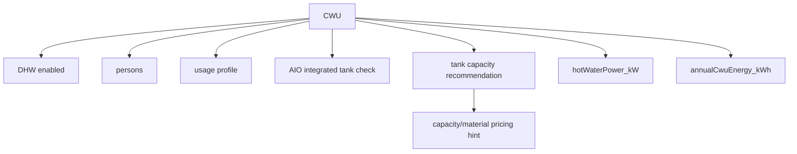
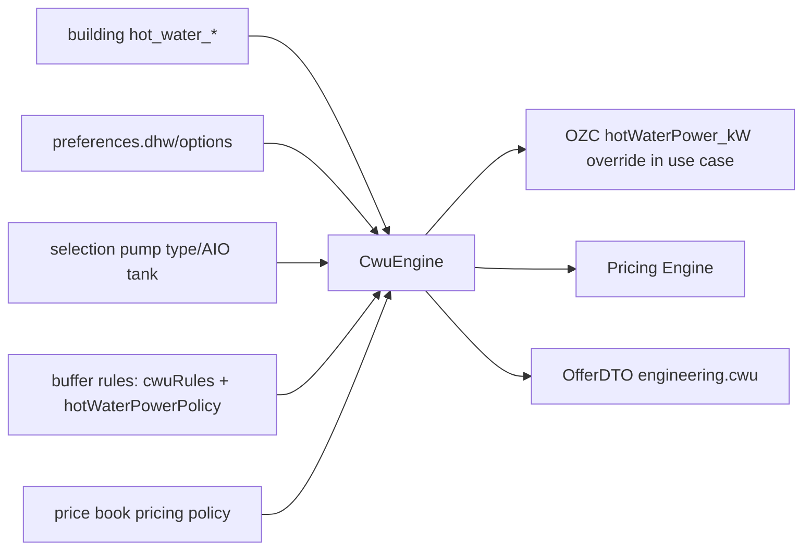
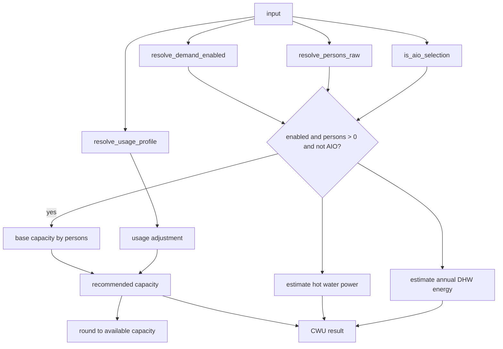

# CWU Engine Graph

> Status: operational audit graph
> Owner: `core/domain/cwu/CwuEngine.php`
> Last verified against code/runtime: 2026-05-20 (GitNexus MCP)
> Source-of-truth level: L2
> GitNexus: `Class:core/domain/cwu/CwuEngine.php:TopInstal_CwuEngine` · entry `compute` (L17 area)

## Knowledge Graph

## Dependency Graph

## Calculation Graph

## Current Notes

- CWU design power is kept separate from OZC design heat loss; `CalculateOfferUseCase` writes CWU power into `engineering.ozc.hotWaterPower_kW` after CWU computation.
- No direct double-count into `designHeatLoss_kW` was found in the offer path.
- GitNexus callers: `CalculateOfferUseCase.resolve_cwu_result`, `TopInstal_OzcEngine.resolve_cwu_engine`, `cwu-engine.regression.php`, `cwu-pricing-catalog.regression.php`.
- Regression harness: PHP/JS CWU parity PASS (2026-05-20).
