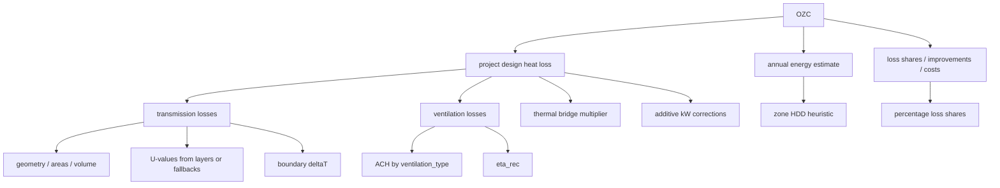
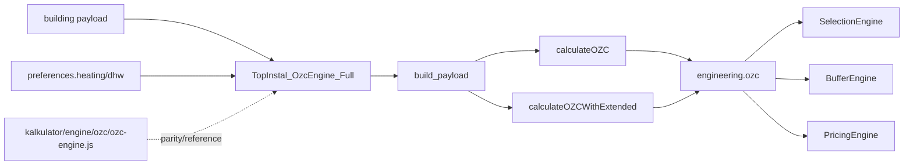

# OZC Engine Graph

> Status: operational audit graph
> Owner: `core/domain/ozc/OzcEngine.php`
> Last verified against code/runtime: 2026-05-20 (GitNexus MCP)
> Source-of-truth level: L2
> Related runtime: `core/domain/ozc/OzcEngine.php`, `kalkulator/engine/ozc/ozc-engine.js`, `core/application/CalculateOfferUseCase.php`

## Knowledge Graph



## Dependency Graph



## Calculation Graph

```mermaid
flowchart TD
  Start[normalized payload] --> Climate[resolveClimate]
  Start --> Geo[computeGeometry]
  Geo --> Areas[computeAreas]
  Start --> U[resolveUValues]
  Start --> Vent[resolveVentilationParams]
  Climate --> DT[thetaInt - thetaE / thetaGround]
  Areas --> HT[HT_i = U_i * A_i]
  U --> HT
  Vent --> HV[HV = 0.34 * V_dot_m3h]
  DT --> PhiT[phiT = sum HT_i * effective deltaT_i]
  HV --> PhiV[phiV = HV * dT * (1 - eta_rec)]
  PhiT --> PhiPsi[phiPsi = phiT * 0.10]
  Start --> Add[computeAdditiveCorrectionsKw]
  PhiT --> Total[designHeatLoss_W]
  PhiV --> Total
  PhiPsi --> Total
  Add --> Total
  Total --> KW[designHeatLoss_kW]
  HT --> HDDH[H_total_for_HDD]
  HV --> HDDH
  HDDH --> Annual[annualEnergy = H_total_for_HDD * HDD * 24 / 1000]
```

## High-Risk Nodes

- `computeAdditiveCorrectionsKw` (GitNexus: `Method:...OzcEngine.php:TopInstal_OzcEngine.computeAdditiveCorrectionsKw#1`, L680; caller: `calculateOZC`; JS parity: `kalkulator/engine/ozc/ozc-engine.js`): likely double-counts windows, doors, recovery ventilation, and basement effects already present in physical terms.
- `computeAnnualEnergy_kWh`: adds full ventilation coefficient to HDD model and does not apply `eta_rec`, so recovery annual energy/cost can be overstated.
- `computeWallStructureThicknessCm`: ambiguous `wall_size` semantics; if UI means structural wall thickness, subtracting insulation is wrong.
- `U_floor` + `shapeCorrection`: rough ground-loss proxy, not PN-EN ISO 13370 equivalent.
