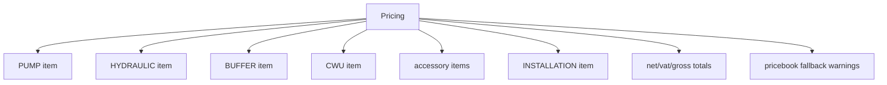
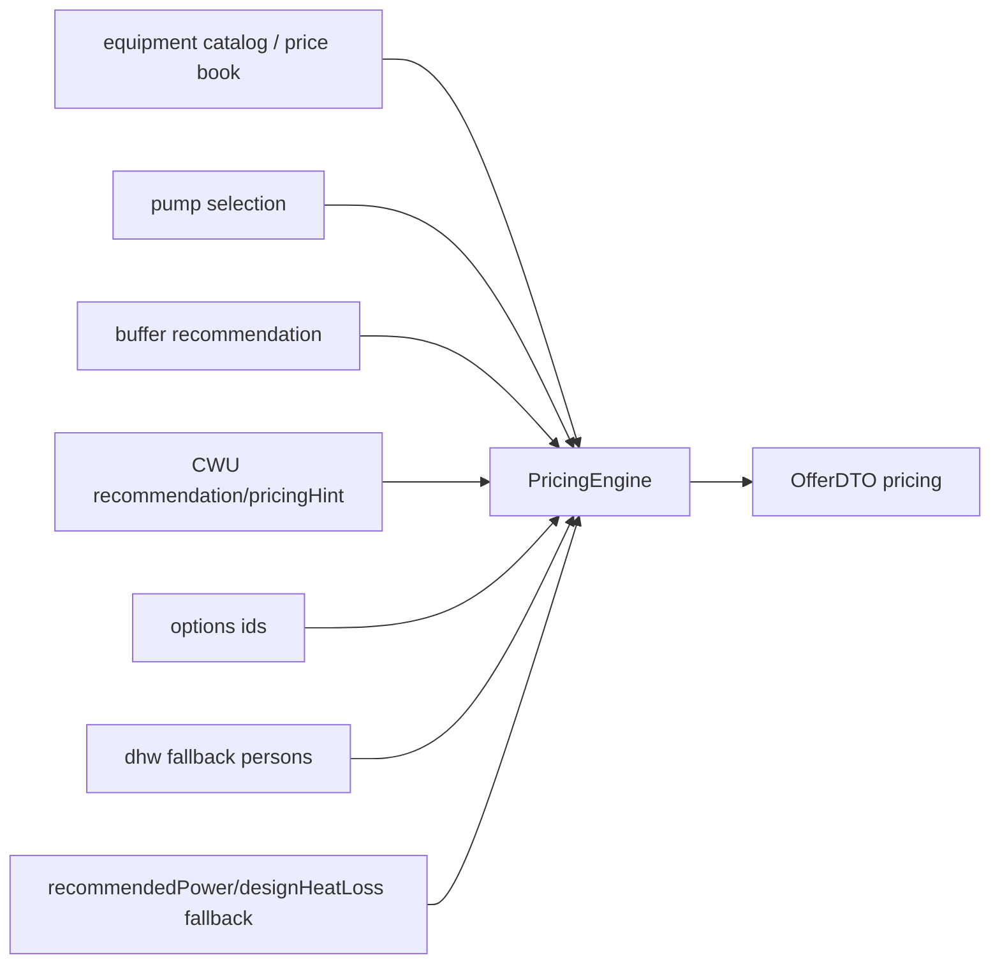
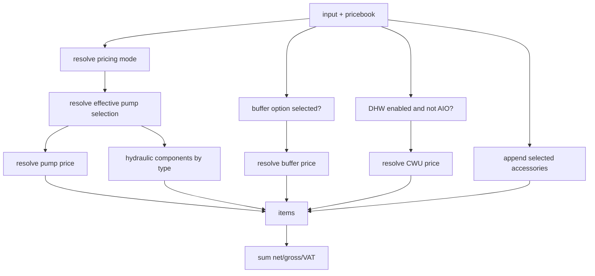

# Pricing Engine Graph

> Status: operational audit graph
> Owner: `core/domain/pricing/PricingEngine.php`
> Last verified against code/runtime: 2026-05-20 (GitNexus MCP)
> Source-of-truth level: L2
> GitNexus: `Class:core/domain/pricing/PricingEngine.php:TopInstal_PricingEngine` · entry `price` (L72 area)

## Knowledge Graph

## Dependency Graph

## Calculation Graph

## Current Notes

- Pricing is backend-owned and should use `OfferDTO.pricing` as commercial truth.
- It can fall back to OZC `designHeatLoss_kW` when selected pump power is unavailable — ties commercial line items to OZC defects.
- GitNexus: `CalculateOfferUseCase.execute` → `price` (CALLS). Regression: `foundation-pricing.regression.php` PASS.
- Upstream OZC cost semantics (SCOP/tariff/CWU split) affect customer-facing totals indirectly via engineering snapshot, not item catalog keys.
