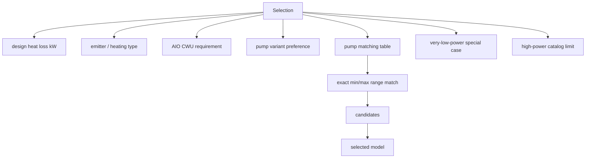
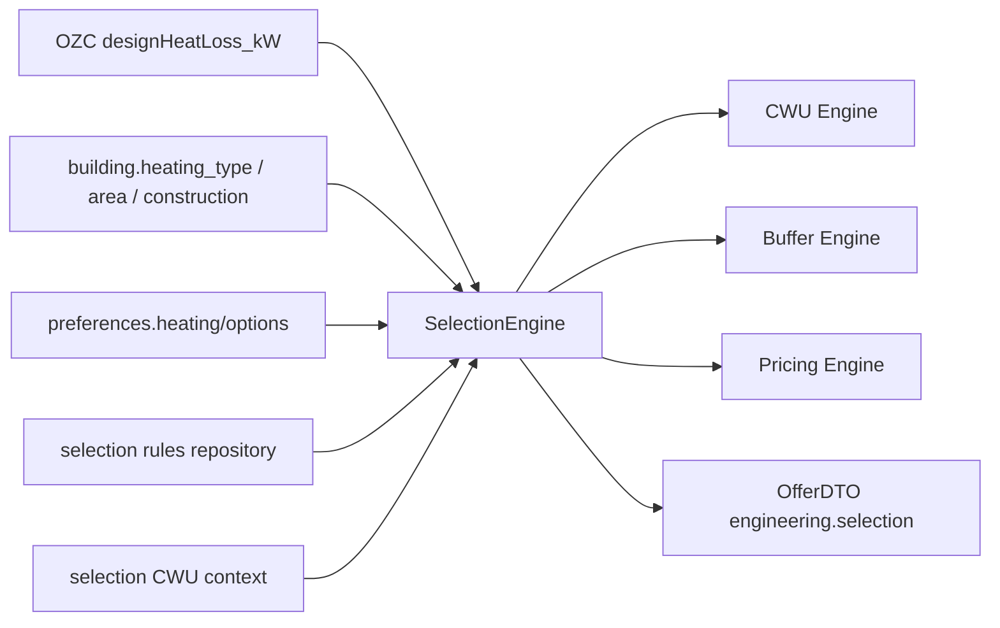
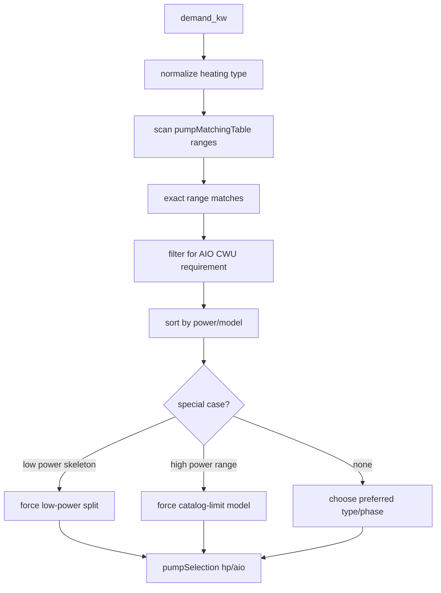

# Selection Engine Graph

> Status: operational audit graph
> Owner: `core/domain/selection/SelectionEngine.php`
> Last verified against code/runtime: 2026-05-20 (GitNexus MCP)
> Source-of-truth level: L2
> GitNexus: `Class:core/domain/selection/SelectionEngine.php:TopInstal_SelectionEngine` · entry `select` (L17)

## Knowledge Graph

## Dependency Graph

## Calculation Graph

## Current Notes

- The engine intentionally uses exact range matching only; nearest fallback is dormant policy.
- It depends directly on OZC realism: if `designHeatLoss_kW` drifts, pump selection drifts immediately.
- GitNexus callers: `selection-aio-cwu.regression.php`, `engine-parity.php` (parity harness currently fails on missing `clonePumpTableFallback` in configurator JS — see detective report).
- AIO/CWU coupling: `resolve_aio_requirement` → `filter_matches_for_cwu_requirement` → `select`; large tank (≥400 L) blocks AIO; 250–350 L AIO only when catalog maps `aio_model_large_cwu`.
