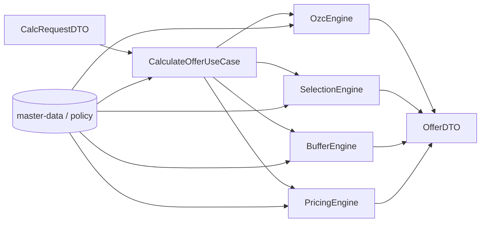
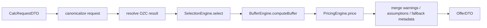

# TOP-INSTAL Core

Canonical calculation and domain engine layer for the TOP-INSTAL HVAC calculator, transforming structured request DTOs into deterministic engineering and pricing output.

## Overview

`core/` is the business and engineering heart of the TOP-INSTAL calculator ecosystem. It exists to keep calculation, equipment selection, buffer sizing, pricing, and structured offer assembly in one deterministic, backend-oriented layer that is independent from UI, WordPress transport, and document generation.

This module accepts stable structured input through `CalcRequestDTO`, orchestrates domain flow through `CalculateOfferUseCase`, applies master-data-driven policy, and returns `OfferDTO` for downstream consumers such as frontend modules, WordPress REST adapters, the offer generator, and automation workflows.

`core/` is **not** a UI module, **not** a WordPress transport layer, and **not** a PDF/document system. It is the source-of-truth business engine that other layers call into.

## Key Features

- Application-level orchestration through `CalculateOfferUseCase`
- Deterministic domain engines for OZC, selection, buffer sizing, and pricing
- Stable request/response contracts: `CalcRequestDTO` and `OfferDTO`
- Structured explainability via warnings, assumptions, and reason codes
- Master-data-driven engineering and system policy
- Regression, parity, fixture, and smoke harnesses for change safety
- Separation of domain logic from UI, HTTP, mail, and document concerns

## Mental Model of the System

At the highest level, `core/` works like this:



The important idea is that `core/` does not “render an offer”; it **computes** one. The application layer controls order and consistency. Domain engines perform specific engineering/business responsibilities. Contracts stabilize integration with the rest of the ecosystem.

## Responsibilities and Boundaries

### `core/` owns

- Canonical calculation flow
- Domain rules for OZC, equipment selection, buffer sizing, and pricing
- Structured offer assembly
- Warnings, assumptions, and traceability fields
- Use of engineering policy and master data
- Contract stability for request and response DTOs

### `core/` does **not** own

- Browser/UI rendering
- DOM logic or step-based frontend flows
- WordPress routing, auth, or REST transport
- Gmail/mail ingress runtime
- PDF/DOCX generation
- Persistence, cron, or operator tooling

This boundary is explicitly reinforced in the module instructions: application code coordinates orchestration and contracts, while domain code must stay pure and deterministic without WordPress, browser, mail, PDF, or persistence concerns.

## System Architecture

The module is organized into five major parts.

### 1. Application layer

`application/` owns orchestration from validated request input to assembled offer output. Its main entrypoint is `CalculateOfferUseCase.php`.

### 2. Domain engine layer

`domain/` contains pure engineering logic split by concern:

- `ozc/`
- `selection/`
- `buffer/`
- `pricing/`

### 3. Contracts layer

`contracts/` defines the stable integration boundary:

- `CalcRequestDTO.js`
- `OfferDTO.js`
- `ReasonCodes.js`
- `ReasonCodes.php`

### 4. Master-data / policy layer

`infrastructure/master-data/` contains engineering and catalog files used by the engines.

### 5. Harness / regression layer

`application/harness/` contains smoke, contract, fixture, parity, audit, and E2E-oriented scripts used to protect determinism.

## Main Calculation Pipeline

The canonical flow implemented by `CalculateOfferUseCase` is:



Step by step:

1. **Request intake and canonicalization**  
   The use case receives a request-like array and normalizes it into the canonical request shape.

2. **Master-data loading**  
   The use case loads price book, buffer rules, and selection rules through repositories passed into the constructor.

3. **OZC resolution**  
   `OzcEngine` either computes or normalizes heating-demand-related output, including warnings, assumptions, audit, and extended metrics.

4. **Equipment selection**  
   `SelectionEngine` chooses a heat pump / variant using design heat loss, building data, preferences, and selection rules.

5. **Buffer sizing / system adjustment**  
   `BufferEngine` determines whether a buffer is needed and what configuration is appropriate based on engineering constraints and context.

6. **Pricing assembly**  
   `PricingEngine` prices the selected configuration using the price book and the outputs of prior engines.

7. **Offer assembly**  
   The use case merges engine outputs into `OfferDTO`, including warnings, assumptions, fallback metadata, and engineering/pricing sections.

## Application Layer

The application layer currently centers around:

- `application/CalculateOfferUseCase.php`

This class is the canonical entrypoint that adapters should call when they want a backend calculation result. It:

- resolves default engines if they are not injected,
- loads required repositories/rules,
- enforces flow ordering,
- merges cross-engine warnings and assumptions,
- assembles final output,
- preserves trace information such as `traceId`.

This separation matters: transport layers such as WordPress REST controllers should **enter** core here rather than reimplement flow themselves.

## Domain Engines

### OZC Engine

File:

- `domain/ozc/OzcEngine.php`

Role:

- computes or normalizes heat-demand-related output,
- manages fallback defaults and engineering assumptions,
- emits warnings and structured audit data,
- includes climate, ventilation, material, and U-value related logic,
- produces extended explainability fields and validation-oriented audit sections.

This is the most engineering-heavy engine and one of the main sources of structured assumptions/warnings.

### Selection Engine

File:

- `domain/selection/SelectionEngine.php`

Role:

- selects appropriate pump/variant based on demand, building characteristics, preferences, and rules,
- interacts with catalog/policy input,
- returns selected model, capacity, and selection-related warnings or advisory data.

### Buffer Engine

File:

- `domain/buffer/BufferEngine.php`

Role:

- determines whether a buffer is needed,
- computes buffer size and configuration-related recommendations,
- uses engineering constraints and context from building, preferences, OZC, and selection output.

This engine exists separately because buffer logic is a distinct engineering concern and should not be hidden inside equipment selection or pricing.

### Pricing Engine

File:

- `domain/pricing/PricingEngine.php`

Role:

- assembles line items and totals,
- uses the selected equipment, buffer result, OZC context, preferences, building context, and price book,
- returns structured pricing data with net/gross totals and pricing-related warnings/fallback metadata.

## Data Contracts

### `CalcRequestDTO`

Defined in:

- `contracts/CalcRequestDTO.js`

Documented shape:

- `schemaVersion`
- optional `traceId`
- `lead`
- `building`
- `preferences`
- optional `context`

This is the canonical input contract for calculation.

### `OfferDTO`

Defined in:

- `contracts/OfferDTO.js`

Documented shape includes:

- `schemaVersion`
- `traceId`
- `engineering`
- optional `engineering.ozc`
- `pricing`
- `warnings`
- `assumptions`
- `engineMeta`

This is the canonical downstream output contract for integrations.

### `ReasonCodes`

Defined in:

- `contracts/ReasonCodes.js`
- `contracts/ReasonCodes.php`

These codes provide stable identifiers for explainability, fallback signaling, and integration-safe interpretation of output conditions.

## Reason Codes and Explainability

`core/` is not a black box. It emits structured explainability through:

- `warnings`
- `assumptions`
- audit payloads in OZC output
- `ReasonCodes`
- `engineMeta.fallbackUsed` and related metadata

This matters because downstream systems need more than a final number. They need to know:

- whether fallback logic was used,
- whether policy/master-data was incomplete,
- which assumptions shaped the result,
- which warnings should be surfaced or logged.

Changes to reason-code semantics should be treated carefully because they affect traceability across the wider system.

## Master Data and Policy Layer

Files:

- `infrastructure/master-data/engineering-policy.json`
- `infrastructure/master-data/equipment-catalog.json`
- `infrastructure/master-data/system-dictionary.json`

These files influence engine behavior and keep policy/config out of ad hoc code branches.

Typical roles:

- engineering policy and defaults,
- equipment catalog / selection support,
- system dictionaries and normalization support.

Developers should be careful when changing these files because master-data edits can alter calculation outcomes without touching PHP code. Changes here should be paired with harness verification.

## Harnesses and Regression Safety

`application/harness/` is a major part of this module’s professionalism. It contains scripts such as:

- `calculate-offer.smoke.php`
- `calculate-offer.fixtures.php`
- `calc-request-contract.regression.php`
- `engine-parity.php`
- `ozc-full-audit.regression.php`
- `rest-calculate-offer.e2e.php`
- fixture JSON files for multiple request scenarios

These provide several safety layers:

- **smoke tests** for basic runtime sanity,
- **fixture tests** for stable scenario coverage,
- **contract regression** to guard request-shape expectations,
- **engine parity** to compare behavior across implementations,
- **audit/regression** for OZC explainability and stability,
- **E2E harnesses** when REST boundary behavior matters.

The local instructions explicitly say to use harnesses and fixtures when changing offer behavior.

## Repository Structure

```text
core/
├── application/
│   ├── CalculateOfferUseCase.php
│   └── harness/
├── contracts/
│   ├── CalcRequestDTO.js
│   ├── OfferDTO.js
│   ├── ReasonCodes.js
│   └── ReasonCodes.php
├── domain/
│   ├── ozc/
│   ├── selection/
│   ├── buffer/
│   └── pricing/
└── infrastructure/
    └── master-data/
```

### Directory responsibilities

- `application/` — use-case orchestration and flow composition
- `application/harness/` — regression, fixture, parity, smoke, and E2E safety tooling
- `contracts/` — stable input/output contract definitions and reason codes
- `domain/` — pure engineering/business engines
- `infrastructure/master-data/` — data-driven policy, catalog, and dictionaries

## Integration with the Wider TOP-INSTAL System

`core/` sits in the middle of the system.

### Upstream callers

- frontend calculator flow
- configurator
- WordPress adapter / REST layer
- mail-ingress driven backend workflow

These layers collect input, normalize transport, or trigger calculations, but they should not reimplement business logic.

### Downstream consumers

- frontend rendering layers
- WordPress adapters/controllers
- offer generator via mapped `OfferDTO`
- diagnostics, automation, and review workflows

The key boundary is:

- **adapters and frontend collect, transport, and present**,
- **core computes and assembles**.

## Development

When modifying `core/`:

- keep business logic inside `core/`, not in UI or adapters,
- preserve contract stability,
- keep engine behavior deterministic,
- centralize policy in master-data where appropriate,
- preserve warnings, assumptions, and reason-code traceability,
- update fixtures/harness expectations when behavior intentionally changes.

The local instructions also explicitly warn against pushing runtime or UI concerns into domain code.

## Testing and Verification

The local module instructions recommend at least:

- `npm run test:contract`
- `npm run test:fixtures`
- `npm run test:rest` when REST boundary behavior is affected

In practice, verification should match the type of change:

- **DTO/contract changes** → contract regression + fixture tests
- **domain logic changes** → fixture/parity/audit harnesses
- **REST-facing effects** → E2E/rest harness where relevant
- **master-data changes** → fixture/parity regression checks

## Common Pitfalls

- Moving business logic into frontend or adapter layers
- Changing DTO semantics without updating harnesses
- Scattering engineering policy outside master-data files
- Adding hidden business exceptions inside unrelated code paths
- Weakening reason-code or assumption traceability
- Changing pricing/selection behavior without fixture updates
- Mixing WordPress/runtime concerns into domain engines

## Additional Documentation

Local documentation inside `core/` is light but meaningful. Useful files include:

- `application/AGENTS.md`
- `domain/AGENTS.md`
- `contracts/OZC_INPUT_REQUIREMENTS.md`
- `contracts/OZC_OUTPUT_REQUIREMENTS.md`

These help clarify boundaries, domain purity, and contract expectations.

## License

No standalone license file is present inside this module archive.
