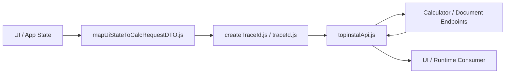

# TOP-INSTAL Frontend API Layer

Frontend integration and request-building layer for the TOP-INSTAL HVAC calculator, responsible for transforming UI state into backend-compatible payloads, attaching trace context, and executing calculator/document API calls.

## Overview

This module is the transport-facing frontend boundary between user-facing calculator/runtime state and the backend calculation system. It exists to keep request shaping, trace propagation, and API invocation separate from visual UI flow and separate from backend domain logic.

In practical terms, the module does three things:

- maps calculator/app state into a payload compatible with backend request contracts,
- generates and propagates trace identifiers across frontend → backend calls,
- wraps runtime API calls such as `calculate-offer` and offer-document generation.

It is **not** the full frontend UI, and it is **not** the backend source of truth for engineering calculations, pricing, or device selection. Its role is to preserve a clean integration boundary: UI state may be messy, partial, or screen-specific, while backend input must be stable and normalized.

## Key Features

- UI-state-to-request mapping
- Backend-compatible payload generation
- Trace ID generation and propagation
- API client abstraction for calculator and document calls
- Payload normalization before submission
- Separation of visual UI concerns from transport concerns
- Retry/timeouts for backend calls where configured
- Support for both calculator requests and offer-document requests

## Mental Model of the System

The module is easiest to understand as:

```text
UI/runtime state
→ mapping layer
→ trace enrichment
→ API request
→ backend response
→ UI/runtime consumer
```

More concretely:

- **UI/runtime state** comes from calculator/app-level state and configurator selections.
- **Mapping layer** converts that state into backend-compatible fields.
- **Trace enrichment** ensures the request carries a stable trace ID.
- **API request** sends the normalized payload to WordPress/backend endpoints.
- **Backend response** is returned back to higher-level frontend/runtime code.

This means the module owns request preparation and transport discipline, not business calculation logic.

## Responsibilities and Boundaries

### What this module owns

- mapping frontend/app state into request payloads,
- normalizing frontend field values before submission,
- attaching trace IDs to requests,
- calling backend calculator and document endpoints,
- preserving a stable integration surface between frontend runtime and backend runtime.

### What this module does **not** own

- rendering the full calculator UI,
- user navigation/step orchestration as a visual flow,
- backend engineering logic,
- pricing logic,
- source-of-truth DTO definitions,
- WordPress routing/auth implementation,
- domain selection rules.

### Boundary rule

UI state shape is **not assumed** to be identical to backend DTO shape.  
This module is responsible for performing that translation, but it must not silently become a hidden business-logic layer.

## System Architecture

The module is currently organized around four files inside `frontend/api/`:

- `mapUiStateToCalcRequestDTO.js` — maps UI/app state into request-compatible payloads
- `topinstalApi.js` — API client layer for backend calls
- `createTraceId.js` — trace ID creation helpers
- `traceId.js` — trace ID helpers exposed for broader runtime use

### High-level architecture



## Mapping Model

This is the heart of the module.

`mapUiStateToCalcRequestDTO.js` takes raw state from the frontend runtime and transforms it into a backend-compatible payload. The file clearly shows that frontend input values are normalized and translated before submission rather than forwarded 1:1.

### What the mapper does

The mapper includes explicit normalization helpers such as:

- `normalizeBool`
- `normalizeHeatingType`
- `normalizeLocationId`
- `normalizeSecondarySourceType`
- `toPositiveNumber`

This is important because user-facing or UI-specific values often differ from backend expectations. For example:

- heating types are normalized into canonical values like `underfloor`, `mixed`, or radiator variants,
- location identifiers are normalized into backend climate-zone style IDs,
- secondary source types are collapsed into canonical categories,
- numeric values are coerced into positive numbers or rejected as nulls.

### Request-shape preparation

The mapper also reads calculator/app state and configurator selections, resolves normalized option IDs, and assembles a structured preferences/options block suitable for backend consumption.

Examples visible in the code include mapping of selections such as:

- pump option ID
- DHW option ID
- buffer option ID
- circulation option ID
- pressure reducer option ID
- water treatment option ID
- foundation option ID
- service option ID
- magnetic filter option ID
- hydro-safety option ID

This shows that the module is not just “serializing form fields”; it is preparing a deliberate backend-facing structure.

### Boundary implication

When changing frontend fields, you must not assume that renaming a UI field is harmless. If the mapper is not updated accordingly, backend compatibility can silently break.

## Traceability Model

Traceability is implemented through `createTraceId.js` and `traceId.js`.

Both files expose the same basic behavior:

- generate a UUID via `crypto.randomUUID()` when available,
- otherwise generate a fallback `trace-...` identifier,
- provide `ensureTraceId(value)` to preserve an existing non-empty trace or generate one when missing.

### Why trace IDs exist

Trace IDs allow a single frontend action to be correlated with backend logs, REST responses, diagnostics, and runtime workflows. This matters because the same request may pass through:

- frontend runtime,
- WordPress REST,
- adapter logging/trace systems,
- core calculation engine,
- downstream workflows such as offer-document generation.

### How trace IDs are propagated

The API client ensures that outbound payloads carry a trace ID. In `calculateOffer()`, if `global.ensureTraceId` exists, the payload’s `traceId` is normalized or created before the request is sent.

### Developer rule

Never remove or bypass trace propagation when changing request flow. If a new request path is added, it should preserve the same trace discipline.

## API Layer

`topinstalApi.js` is the module’s transport client.

It wraps runtime calls to backend endpoints and handles practical request concerns such as:

- endpoint resolution,
- nonce and WordPress REST nonce handling,
- request timeout behavior,
- retry behavior,
- JSON parsing,
- response/error normalization.

### Calculator API call

The main visible calculator call is `calculateOffer(dto, options)`.

Its default endpoint is:

```text
/wp-json/topinstal/v1/calculate-offer
```

The client:

- resolves transport config from `global.HEATPUMP_CONFIG`,
- injects `X-Topinstal-Nonce` when available,
- optionally injects `X-WP-Nonce` for logged-in REST requests,
- adds/ensures `traceId` on the payload,
- uses fetch with timeout/AbortController where available,
- retries under limited conditions.

This means the frontend integration layer is not a raw `fetch()` call site. It is a controlled API wrapper.

### Offer-document support

The file also contains offer-document-related timeout and error helpers, which indicates that this module supports at least part of the document-generation request path as well. This places it as a frontend-facing transport layer for multiple backend/runtime operations, not only raw calculation.

### What should not happen here

This layer should not accumulate business logic or user-flow orchestration. It should remain transport-focused.

## Request Preparation and Backend Compatibility

A central responsibility of this module is keeping outbound requests compatible with backend expectations even when frontend state evolves.

### Compatibility strategy visible in code

The mapper:

- normalizes string aliases into canonical values,
- derives missing area from dimensions when necessary,
- converts multiple possible frontend/source field names into one backend-facing shape,
- resolves option IDs from configurator state.

That means this layer acts as the anti-corruption layer between UI/runtime state and backend contracts.

### Why this matters

Without this layer:

- frontend-specific naming leaks into backend contracts,
- backend changes would force UI code to know too much,
- traceability and normalization would be inconsistent,
- debugging request drift would become much harder.

### Change discipline

Any change to:
- frontend field names,
- selection identifiers,
- request semantics,
- trace keys,
- endpoint expectations

should be reviewed together with this module.

## Repository Structure

```text
frontend/
└── api/
    ├── createTraceId.js
    ├── mapUiStateToCalcRequestDTO.js
    ├── topinstalApi.js
    └── traceId.js
```

### File responsibilities

- **`createTraceId.js`** — generates and normalizes trace IDs.
- **`traceId.js`** — trace helper exposure for runtime/frontend use.
- **`mapUiStateToCalcRequestDTO.js`** — converts UI/app/configurator state into backend-compatible request payloads.
- **`topinstalApi.js`** — sends normalized payloads to backend endpoints with proper trace/auth/timeout behavior.

## Integration with the Wider TOP-INSTAL Calculator System

This module sits between user-facing runtime code and backend/runtime services.

Its place in the system is:

```text
UI state / calculator flow / configurator selections
→ frontend integration layer
→ wp-adapter / REST runtime
→ core calculation engine
```

### Relationship to other modules

- **visual calculator flow/UI modules** own rendering and user progression
- **konfigurator** contributes additional option selections and frontend-side preferences
- **wp-adapter** exposes the backend/runtime transport surface inside WordPress
- **core** owns calculation, engineering, and pricing source-of-truth logic
- **downstream offer/document workflows** may be triggered through API calls exposed from this layer

This module is the contract-preserving bridge between those layers.

## Development

When changing this module, the safest mindset is:

- normalize frontend state,
- preserve traceability,
- keep API behavior explicit,
- do not move business logic into mapping code.

### Safe modification guidelines

- Change `mapUiStateToCalcRequestDTO.js` when frontend state shape changes.
- Keep canonical-value normalization explicit and readable.
- Update transport config handling only inside `topinstalApi.js`.
- Preserve trace ID behavior when adding new request paths.
- Coordinate request-shape changes with backend contracts.
- Avoid screen-specific hacks leaking into shared mapping code.

## Testing and Verification

Because this module sits on the integration boundary, verification should focus on payload correctness and transport correctness.

Recommended verification areas:

- inspect generated request payloads,
- verify trace ID creation and propagation,
- confirm calculator API calls hit the expected endpoint,
- confirm nonce behavior for the expected runtime mode,
- verify offer-document request paths if they depend on this client,
- perform integration checks against a real or staging backend.

### Types of changes that need runtime verification

- request-shape changes,
- trace propagation changes,
- endpoint changes,
- nonce/auth header changes,
- timeout/retry changes.

### Types of changes that may be lower-risk

- documentation-only changes,
- isolated refactors that preserve API behavior exactly,
- internal helper cleanup with unchanged input/output behavior.

If the wider repository provides JS verification commands such as `npm run verify:js`, those should be used alongside practical payload/endpoint inspection.

## Common Pitfalls

Common mistakes in this kind of module include:

- treating UI state shape as identical to backend DTO shape,
- duplicating business logic inside request mapping,
- silently changing request field semantics,
- breaking trace propagation,
- tightly coupling API code to one screen’s internal assumptions,
- changing endpoint behavior without updating backend/runtime expectations,
- assuming nonce/auth strategy is the same in every runtime context.

## Additional Documentation

This module is small and focused, so its code structure is itself a strong source of truth. It should be read alongside broader module docs for:

- frontend calculator flow,
- configurator,
- `wp-adapter`,
- `core`.

That broader context is necessary to fully understand where this layer begins and ends.

## License

No module-specific license file is assumed here unless one exists in the repository. If this module is intended for public distribution, add an explicit license.
