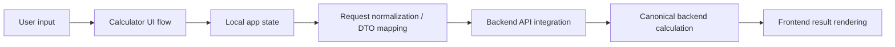
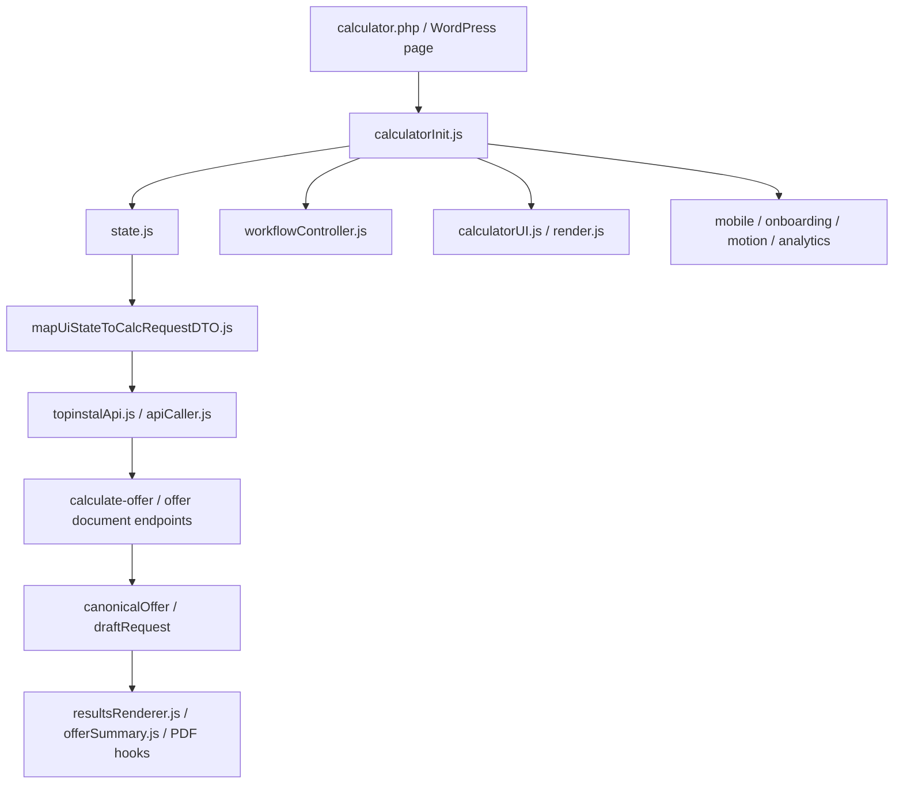

# TOP-INSTAL Kalkulator

Frontend calculator flow module for collecting building and system inputs, managing the multi-step user journey, and preparing backend-compatible request data inside the wider TOP-INSTAL HVAC calculator system.

---

## Overview

**TOP-INSTAL Kalkulator** is the user-facing calculator flow used on the site to guide a visitor from initial building data to a request-ready state that can be consumed by the backend calculation pipeline.

This module is responsible for:

- rendering the visible calculator experience,
- handling step-by-step progression,
- collecting and validating form input,
- maintaining calculator UI state,
- normalizing user answers into structured data,
- preparing backend-facing request payloads,
- coordinating result-oriented frontend actions such as calculation calls and offer/PDF-related flows.

This module is **not** the final source of truth for engineering calculations, heat-loss logic, equipment selection, buffer sizing, or pricing. Those responsibilities belong to the backend calculator stack and related downstream systems.

In the broader TOP-INSTAL ecosystem, this module sits between the page/WordPress runtime and the backend calculation layer:



---

## Key Features

- multi-step calculator flow with guided progression,
- scoped initialization for WordPress/Elementor environments,
- local UI state and session-backed app state,
- field visibility, enablement, and reset logic,
- validation and input normalization,
- request-ready mapping through `mapUiStateToCalcRequestDTO.js`,
- backend-first calculation via `calculate-offer`,
- canonical offer / draft request handling in frontend state,
- result rendering and offer/PDF related frontend hooks,
- analytics, motion, onboarding, tooltips, and mobile-specific behavior,
- regression-oriented JS verification coverage.

---

## Mental Model of the System

The easiest way to understand this module is as a **frontend flow controller** layered on top of a larger backend-authoritative calculator system.

At a high level:


Conceptually, the module does six things:

1. **bootstraps the calculator runtime** inside a WordPress page,
2. **binds DOM and module state** to a specific calculator instance,
3. **drives the step flow** and user interaction,
4. **keeps local UI state coherent** across steps and reloads,
5. **transforms UI state into backend-compatible data**, and
6. **renders or updates frontend results** once backend data comes back.

The backend still owns canonical engineering decisions. The frontend can shape the journey and prepare the request, but it should not silently become an engineering truth source.

---

## Responsibilities and Boundaries

This section is the most important architectural guardrail for the module.

### What this module owns

- page-level calculator bootstrapping,
- DOM binding and runtime lifecycle for calculator instances,
- multi-step UX flow and tab progression,
- local UI state and session persistence,
- field visibility / enablement / reset behavior,
- input handling and normalization,
- mapping UI state into request-ready payloads,
- calling backend calculation/document endpoints,
- rendering results and frontend summaries.

### What this module does **not** own

- canonical OZC / engineering truth,
- final device selection authority,
- final buffer sizing authority,
- final pricing authority,
- backend DTO validation rules,
- final offer/document generation logic.

### Architectural boundary

`AGENTS.md` is explicit about the intended model:

- **treat backend calculation as canonical**,
- **do not reintroduce frontend-only engineering truth**,
- prefer visible flow logic over hidden state magic,
- keep field enablement, visibility, and reset behavior explicit.

That means frontend behavior must remain aligned with backend contracts rather than drifting into a parallel calculator implementation.

---

## System Architecture

The module is organized around a runtime bootstrap plus a set of focused frontend subsystems.

### Major parts

- **WordPress entrypoint** — `calculator.php` renders the HTML shell and calculator form.
- **Bootstrap/runtime init** — `calculatorInit.js` finds the active calculator root, guards against duplicate initialization, and wires modules.
- **State layer** — `state.js` manages instance-scoped app state, session persistence, canonical offer state, draft request state, and UI flags.
- **Flow/navigation layer** — `workflowController.js`, `tabNavigation.js`, and related modules manage progression, progress bar state, and transitions.
- **Rendering layer** — `render.js`, `calculatorUI.js`, `resultsRenderer.js`, `offerSummary.js`, `uiSummary.js`, `floorRenderer.js` control visible UI behavior.
- **Request/payload layer** — `mapUiStateToCalcRequestDTO.js`, `offerPayload.js`, `formDataProcessor.js`, `topinstalApi.js`, `apiCaller.js` transform frontend data into backend-ready shapes and execute HTTP requests.
- **Rule/validation layer** — `rules.js`, `render.js`, dynamic field helpers, and validation-related logic determine visibility, enablement, and flow consistency.
- **UX support modules** — analytics, onboarding, motion, tooltip, mobile, progressive disclosure, AI dock/watchers, GDPR helpers.
- **Styling layer** — multiple CSS files structure the visual system for layout, onboarding, workflow, mobile redesign, WordPress integration, and error display.

### Architecture diagram



---

## Runtime Flow

The normal runtime path looks like this:

1. **Page loads** and `calculator.php` provides the HTML structure and asset URLs.
2. **`calculatorInit.js` executes** inside an IIFE, checks Elementor edit mode, finds the active root, and prevents double initialization.
3. A **scoped DOM context** is created so multiple calculator roots or WordPress clones do not collide.
4. **State initialization** runs early so the rest of the modules can rely on shared app state.
5. The runtime waits for **`formEngine` readiness** before initializing modules that depend on it.
6. Workflow/UI modules attach listeners for:
   - input changes,
   - step navigation,
   - progress updates,
   - visibility/enabled-state changes,
   - result rendering.
7. User input updates **local form state and app state**.
8. Validation, field gating, and normalization determine whether the user can progress.
9. When a calculation or offer-related action is triggered, the module builds a **request-ready payload**.
10. The frontend calls the backend through `topinstalApi.js` / `apiCaller.js`.
11. The response is written into **canonical frontend state** (`canonicalOffer`, `draftRequest`, `offer`) and then rendered into UI summaries/results.

---

## Step / Screen Flow

This module is clearly multi-step.

Visible evidence in `workflowController.js` shows an explicit progress model and step progression logic, with stages such as:

- start/introduction,
- dimensions/building characteristics,
- construction-related inputs,
- openings/windows/doors,
- insulation/finalization,
- results.

The exact visible labels are driven by the runtime and should be treated as part of UX behavior, not backend business semantics.

### How the flow works

- The calculator keeps a notion of the **current tab / current step**.
- Step transitions depend on current state validity and field gating.
- Invalid or incomplete fields can prevent progression.
- Visibility and enablement rules affect what the user can see and modify in each phase.
- Some later stages render result-oriented or review-oriented content rather than raw input forms.

The step flow is therefore not just static HTML. It is an orchestrated user journey with runtime gating and state transitions.

---

## State Model

`state.js` provides the backbone of the calculator runtime.

### Main concepts in state

The module keeps multiple categories of state, including:

- **form values** — raw/in-progress field values,
- **app state** — normalized page-level calculator state,
- **current tab** — current step in the workflow,
- **draftRequest** — request-ready or partially request-ready backend payload state,
- **canonicalOffer** / `offer` — backend-derived canonical frontend offer state,
- **configuratorSelection** — downstream configuration input when present,
- **uiFlags** — runtime UI behavior such as active view or completion animation flags,
- **timestamp** — save/update bookkeeping.

### State characteristics

- State is **instance-scoped** to support multiple calculator instances on the same page/runtime.
- App state is **normalized** before use.
- State is persisted into **sessionStorage** using instance-specific keys.
- State updates can synchronize related fields such as `canonicalOffer` and `offer`.
- The module distinguishes between transient UI behavior and more durable request/result state.

This is a richer model than “just a form”. It is effectively a small frontend runtime state machine for the calculator journey.

---

## Validation and Input Handling

Validation and input handling are spread across dedicated helpers and rendering/rules logic.

### What the module does

- captures user input from form fields and UI cards,
- normalizes booleans, numeric values, and text values,
- applies field visibility and enablement rules,
- clears blocked or invalid state when fields become unavailable,
- prevents invalid progression through step flow,
- updates UI feedback based on validity and gating.

### Important characteristics

- Validation is tied to **flow progression**, not only final submit.
- Some fields are shown/hidden dynamically depending on current answers.
- Some state is actively reset when a field becomes blocked or irrelevant.
- The module avoids hidden “magic” by driving visibility and enablement through explicit rules and render helpers.

Developers changing field semantics, selector wiring, or normalization rules must treat this as flow logic, not just cosmetic form logic.

---

## Request Preparation and Downstream Integration

This section is the second most important boundary after responsibilities.

### Core request-preparation path

The module prepares backend-compatible request data through files such as:

- `mapUiStateToCalcRequestDTO.js`
- `formDataProcessor.js`
- `offerPayload.js`
- `topinstalApi.js`
- `apiCaller.js`

### What happens here

- raw UI state is collected,
- values are normalized,
- configurator selections or draft state can be merged in,
- a structured backend-facing DTO-compatible object is built,
- a trace ID can be attached,
- the request is sent to the canonical backend endpoint.

`topinstalApi.js` shows the intended backend-first seam clearly:

- `calculateOffer()` sends a JSON request to `/wp-json/topinstal/v1/calculate-offer`,
- `generateOfferDocument()` supports downstream document generation.

`apiCaller.js` is explicit that calculation is **backend-first** and that frontend state should be updated from backend canonical results.

### Architectural implication

This frontend module should prepare a clean request shape and consume the backend result, but it should not drift into silently re-implementing backend engineering logic.

When changing fields or payloads, developers must preserve:

- DTO shape compatibility,
- traceability of user choices,
- alignment with backend contract expectations,
- consistency between `draftRequest`, `canonicalOffer`, and visible UI.

---

## Styling and UI Layer

The styling layer is broad and purpose-specific.

### CSS files in the module

- `css/main.css` — primary calculator styling baseline,
- `css/workflow-system.css` — workflow/progression-related visuals,
- `css/mobile-redesign.css` — mobile-specific UX/layout adjustments,
- `css/wordpress-integration.css` — WordPress/embedding-specific integration styling,
- `css/error-system.css` — error handling and error presentation,
- `css/onboarding-modal.css` — onboarding UX.

### Styling characteristics

- The module is embedded inside a WordPress-rendered calculator wrapper and scoped runtime containers.
- Visual concerns are split by concern rather than one monolithic stylesheet.
- Responsiveness and WordPress integration are first-class concerns.
- Motion and progressive disclosure are supported by dedicated JS modules and must be validated together with CSS changes.

When editing styles, frontend engineers should verify:

- root/container scoping,
- step-flow layout integrity,
- mobile layout behavior,
- onboarding/error overlays,
- WordPress embedding edge cases.

---

## Repository Structure

```text
kalkulator/
├── AGENTS.md
├── calculator.php
├── css/
│   ├── error-system.css
│   ├── main.css
│   ├── mobile-redesign.css
│   ├── onboarding-modal.css
│   ├── wordpress-integration.css
│   └── workflow-system.css
└── js/
    ├── calculatorInit.js
    ├── calculatorUI.js
    ├── workflowController.js
    ├── state.js
    ├── render.js
    ├── mapUiStateToCalcRequestDTO.js
    ├── topinstalApi.js
    ├── apiCaller.js
    ├── offerPayload.js
    ├── resultsRenderer.js
    ├── offerSummary.js
    ├── uiSummary.js
    ├── rules.js
    ├── tabNavigation.js
    ├── formDataProcessor.js
    ├── pdfGenerator.js
    ├── downloadPDF.js
    ├── emailSender.js
    ├── analytics.js
    ├── onboardingSystem.js
    ├── mobileController.js
    ├── motionSystem.js
    ├── tooltipSystem.js
    ├── aiWatchers.js
    └── regression tests (*.regression.test.js)
```

### Key files

- **`AGENTS.md`** — architectural instructions and boundaries for work in this module.
- **`calculator.php`** — WordPress-side HTML shell and shortcode template.
- **`calculatorInit.js`** — guarded bootstrap and module initialization.
- **`workflowController.js`** — progression, progress bar, flow orchestration.
- **`state.js`** — instance-scoped app state and session persistence.
- **`render.js`** — visibility, enablement, and field/container UI updates.
- **`mapUiStateToCalcRequestDTO.js`** — request-ready DTO mapping.
- **`topinstalApi.js`** — HTTP client for backend calculation and document generation seams.
- **`apiCaller.js`** — backend-first calculation execution and canonical state updates.
- **`offerPayload.js`** — canonical offer payload building for CRM/PDF/email related frontend flows.
- **regression tests** — targeted JS contract and UX regression safety net.

---

## Integration with the Wider TOP-INSTAL Calculator System

This module is only one layer in a bigger system.

### What it expects

- a WordPress page/runtime with the calculator markup,
- `HEATPUMP_CONFIG` and related runtime config,
- supporting frontend modules such as scoped DOM, form engine, motion system,
- backend endpoints for calculation and document generation.

### What it hands off

- normalized, request-ready input to the backend calculation system,
- frontend state that can be consumed by configurator/result/document flows,
- canonical offer state returned from the backend.

### Relationship to other modules

- **`core/`** owns backend engineering logic and DTO authority.
- **`wp-adapter/`** owns REST/auth/WordPress adapter behavior.
- **`konfigurator/`** extends the user flow with machine-room configuration and traceable preferences.
- **this `kalkulator/` module** owns the visible calculator journey and prepares the handoff.

That means this module should always be developed with awareness of downstream DTO contracts and backend calculation authority.

---

## Development

When modifying this module, follow these rules:

1. **Treat backend calculation as canonical.**
2. **Do not silently add frontend-only engineering truth.**
3. **Preserve request/payload compatibility.**
4. **Keep step, field, and selector changes explicit and testable.**
5. **Preserve state traceability across flow transitions.**
6. **Do not mix cosmetic UI changes with payload/flow semantics unless necessary.**

### Safe change patterns

- add new fields by updating UI, state handling, validation, and payload mapping together,
- update selectors carefully and validate against WordPress/Elementor embedding,
- keep configurator-derived state and backend request state synchronized,
- make visible UX changes with browser verification, not guesswork.

### Unsafe change patterns

- hardcoding backend business rules into UI logic,
- changing field meaning without updating downstream payload mapping,
- breaking state normalization or canonical offer synchronization,
- relying on hidden state mutations instead of explicit flow logic.

---

## Testing and Verification

`AGENTS.md` already defines the expected verification posture for this module.

### Required verification after changes

- `npm run verify:js`
- targeted regression tests in `kalkulator/js/*.test.js` where relevant
- browser verification for visible UX changes

### Changes that require browser/manual validation

- anything affecting step progression,
- field visibility or enablement,
- mobile layout changes,
- onboarding/motion/tooltip behavior,
- summary/results rendering,
- selector changes in WordPress/Elementor contexts.

### Existing test coverage hints

The module already contains regression tests for areas such as:

- payload mapping,
- OZC-related regressions,
- rule regressions,
- UI regressions,
- offer projection,
- API behavior,
- state/offer handling.

That is a strong signal that this module should be evolved with regression discipline rather than manual guesswork.

---

## Common Pitfalls

- duplicating backend rules in frontend code,
- treating UI-normalized state as engineering truth,
- breaking step progression when changing field gating,
- breaking request/payload compatibility when renaming fields,
- coupling logic too tightly to fragile DOM selectors,
- forgetting session/app state side effects when changing flow behavior,
- changing visible UI without browser verification,
- assuming local frontend summaries are equivalent to canonical backend offer data.

---

## Additional Documentation

This module references wider-project docs from `AGENTS.md`, including:

- `docs/contracts/field-mapping.md`
- `docs/contracts/payload-field-classification.md`
- `docs/discovery/repo-discovery.md`

If you are making deeper changes to flow semantics or payload compatibility, those documents should be reviewed together with this module.

---

## License

No module-specific license file is present in this extracted package.

If this module is intended for external distribution, add an explicit license in the parent repository.
