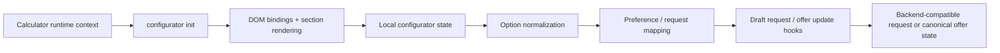
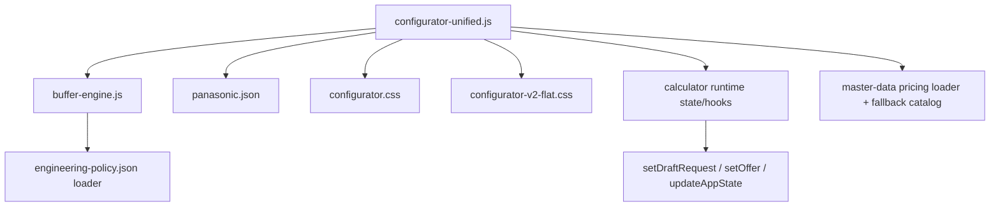

# TOP-INSTAL Konfigurator

Frontend machine-room configurator for the TOP-INSTAL calculator, responsible for rendering configuration choices, maintaining traceable selection state, and shaping backend-compatible preference output without replacing backend engineering authority.

## Overview

**TOP-INSTAL Konfigurator** is a frontend subsystem inside the broader HVAC calculator. It renders the "machine room" portion of the user flow: heat-pump presentation, buffer/CWU/accessory choices, hydraulics-related recommendations, summary rendering, and selection persistence.

It exists to solve a specific problem: the calculator needs a rich, interactive configuration layer for end-user choices, but those choices still have to remain compatible with the backend calculation model and final offer flow. The configurator therefore owns UI state, option rendering, and mapping of selections into structured frontend output, while the backend remains the final authority for engineering decisions and offer generation.

This module is **not** the full calculator, **not** the source of truth for final engineering decisions, and **not** the place to duplicate pricing or offer logic already owned by backend contracts. Its job is to guide and normalize user-facing configuration, then hand off traceable, DTO-compatible state to the rest of the TOP-INSTAL runtime.

## Key Features

- Machine-room configuration UI mounted inside the calculator runtime
- Unified configurator runtime with state persistence and rehydration
- Traceable option mapping into backend-compatible preferences and draft request payloads
- Canonical standalone `BufferEngine` for buffer sizing/recommendation logic
- Local device/spec catalog support via `panasonic.json`
- Remote master-data loading with fallback behavior for pricing/rules
- CSS scoped to `#configurator-app` to avoid global style collisions
- Runtime integration hooks for canonical offer state, draft request updates, and calculator app state

## Mental Model of the System

The configurator is easiest to understand as a **frontend decision-shaping layer** inside a larger calculator runtime.



At a high level:

- the calculator provides runtime context (`root`, `dom`, `state`),
- the configurator initializes UI bindings and local state,
- user selections are captured and normalized into structured identifiers,
- helper logic such as buffer recommendations influences visible options and derived state,
- resulting selections are pushed into draft request / canonical offer integration hooks.

The important boundary is that the configurator helps shape frontend choices, but backend calculation and final offer authority remain elsewhere.

## Responsibilities and Boundaries

`AGENTS.md` is explicit about the architectural contract for this module:

- the configurator **owns machine-room configuration choices, option mapping, and configurator-specific rendering**;
- configuration choices **must not override backend engineering authority without explicit contract logic**;
- option IDs and selected variants **must remain traceable into DTO preferences**;
- offer logic **must not be duplicated here**.

That means this module may:

- render and update UI,
- keep track of selected option IDs,
- compute frontend recommendations and helper summaries,
- shape draft request / preference payloads.

It must not:

- become the source of truth for final engineering decisions,
- independently redefine offer/business logic already owned by backend contracts,
- hide frontend choices behind opaque UI-only state that cannot be traced downstream.

In practice, if configurator output seems inconsistent with the final offer, the preferred debugging path is to trace option mapping and then verify backend authority rather than patching logic directly into the configurator.

## System Architecture

The module is organized around one main runtime file plus a small set of support assets.



Main parts:

- **`configurator-unified.js`** — primary runtime entrypoint, state management, rendering, mapping, master-data loading, and integration with calculator app state.
- **`buffer-engine.js`** — standalone canonical module for buffer sizing and recommendation logic.
- **`panasonic.json`** — local product/spec catalog used to enrich configurator rendering and pump metadata lookup.
- **`configurator.css` / `configurator-v2-flat.css`** — scoped styling layers for configurator UI.
- **calculator runtime hooks** — functions such as `updateAppState`, `setDraftRequest`, and `setOffer` supplied through runtime context.

## Runtime Flow

The runtime starts inside `configurator-unified.js`, which exposes the module under `window.__HP_MODULES__.configurator`.

Typical flow:

```mermaid
flowchart LR
    A[Runtime context provided] --> B[init(ctx)]
    B --> C[Resolve root, DOM, state hooks]
    C --> D[Load buffer rules + pricing data]
    D --> E[Initialize configurator app]
    E --> F[Resolve DOM nodes and sections]
    F --> G[Restore or populate local state]
    G --> H[Render options and summaries]
    H --> I[Capture user selections]
    I --> J[Map into structured output]
    J --> K[Update draft request / canonical offer state]
```

Step-by-step:

1. `init(ctx)` validates that runtime context includes at least `root` and `dom`.
2. The configurator resolves optional runtime dependencies such as `bufferEngine`, motion helpers, and app-state hooks.
3. It attempts to load buffer rules and pricing/master data asynchronously.
4. It initializes the configurator app against the DOM mount point.
5. It can populate itself from existing calculator/canonical state if building data is already present.
6. User selections update local configurator state.
7. State is normalized into draft/canonical payloads that can survive downstream backend processing.
8. A disposer is returned so event listeners, timers, and observers can be cleaned up safely.

## Buffer Engine

`buffer-engine.js` is a mandatory architectural piece, not just a convenience helper.

It is explicitly described in code as the **canonical buffer logic** and a **single source of truth for buffer logic** usable by:

- `configurator-unified.js`,
- optional tools,
- optional regression tests.

Its role is to solve the buffer-recommendation problem in a separate, reusable module instead of burying that logic inside general configurator rendering.

What it does:

- loads buffer rules from `engineering-policy.json`,
- falls back to embedded defaults when remote rules are unavailable,
- calculates sizing components,
- computes final buffer recommendation,
- normalizes recommendation payloads for downstream use.

Visible concepts in the code include:

- capacity-per-kW rules by emitter type,
- system volume per m²,
- bivalent storage rules,
- available and minimum capacities,
- anti-cycling defaults,
- absolute rules such as special 3-phase K-series requirements,
- CWU-related supporting rules,
- fallback/default rules when remote policy is missing.

This separation is architecturally important because buffer sizing is not just a visual option. It is a rules-driven concern that may need to remain consistent across multiple runtime contexts.

At runtime, the configurator tries to use `runtimeAppState.bufferEngine` first, then falls back to `window.BufferEngine`, preserving compatibility with asynchronous loading.

## Data Sources and Local Catalogs

The configurator uses both **local module assets** and **remote master-data**.

### `panasonic.json`

This file is a local structured catalog of heat-pump kit/spec data, including fields such as:

- kit identifier,
- series / generation,
- phase,
- refrigerant,
- split type,
- auxiliary heater information,
- heating/cooling performance,
- SCOP classes,
- indoor/outdoor unit details,
- sound level, dimensions, and weight.

Inside the runtime, `panasonic.json` is loaded asynchronously and used to map selected pump models to richer metadata for presentation and configurator decisions.

This local catalog should be treated as **UI-supporting product/spec data**, not necessarily the final backend source of truth for engineering or commercial decisions.

### Remote master-data

`configurator-unified.js` also attempts to load pricing/master-data externally and explicitly distinguishes between:

- **master mode** — remote master-data available and complete,
- **fallback mode** — remote master-data unavailable or incomplete.

This is important: the configurator is designed to continue working in degraded mode, but it preserves warnings and source information when it has to fall back.

## State and Mapping Model

A core requirement of this module is traceability.

The configurator keeps local state for selections, restores/saves state, and then maps those selections into structured output. The code includes explicit helpers for:

- saving and loading configurator state,
- restoring selections into the UI,
- building configurator preference options,
- building configurator source payloads,
- building configurator-side `CalcRequestDTO`-compatible payloads,
- syncing canonical offer state,
- persisting recommendation/config data snapshots.

This means user choices are not supposed to disappear into visual-only state. Instead, they are transformed into:

- selected option identifiers,
- normalized recommendation data,
- draft request state,
- canonical offer/config snapshots.

That mapping layer is one of the most important design constraints of this module because frontend choices must remain visible and explainable downstream.

## Styling and UI Layer

The configurator styling is explicitly scoped to `#configurator-app`, which is a good isolation strategy for a subsystem embedded inside a larger calculator UI.

### `configurator.css`

This file defines:

- motion tokens,
- easing curves,
- accent variables,
- interaction states,
- form focus styling,
- reveal/preview effects,
- reduced-motion handling via `prefers-reduced-motion`.

It behaves like a motion-aware UI foundation layer.

### `configurator-v2-flat.css`

This file defines a larger set of design tokens and layout rules, including:

- typography,
- spacing,
- radii,
- color tokens,
- shadows,
- section/card layout,
- sticky summary and section structure.

It is more layout- and component-oriented, and is clearly intended to align the configurator visually with the broader calculator design language while keeping variables scoped locally.

For frontend work, the practical guidance is:

- keep styles scoped to `#configurator-app`,
- respect existing design tokens instead of hardcoding values repeatedly,
- preserve reduced-motion behavior,
- validate visible rendering changes in the browser.

## Repository Structure

```text
konfigurator/
├── AGENTS.md                  # Architectural rules and verification guidance
├── configurator-unified.js    # Main configurator runtime and integration layer
├── buffer-engine.js           # Canonical buffer sizing/recommendation engine
├── configurator.css           # Scoped motion/foundation styling
├── configurator-v2-flat.css   # Scoped layout/token/component styling
└── panasonic.json             # Local pump/spec catalog used by the UI
```

File responsibilities:

- **`AGENTS.md`** — source of truth for module boundaries, traceability, and verification expectations.
- **`configurator-unified.js`** — main runtime orchestration, loading, selection management, mapping, and integration hooks.
- **`buffer-engine.js`** — rules-driven buffer logic separated for reuse and consistency.
- **`configurator.css`** — scoped interaction and motion layer.
- **`configurator-v2-flat.css`** — scoped visual system and section/card layout.
- **`panasonic.json`** — local technical catalog for model metadata.

## Integration with the Calculator

This module is not standalone. It expects to run inside a larger calculator runtime and receive integration context.

Visible runtime expectations include:

- `root` and `dom` references,
- optional `state` object,
- hooks such as `getAppState`, `updateAppState`, `setDraftRequest`, and `setOffer`,
- optional `bufferEngine`, motion helpers, and config.

It also publishes a runtime API through `window.__HP_MODULES__.configurator`, including methods such as:

- `init`,
- `destroy`,
- `saveState`,
- `loadState`,
- `restoreState`,
- `recompute`,
- `loadFromCanonicalState`.

This makes the configurator a reusable frontend module inside the calculator rather than a page with anonymous scripts.

The boundary to remember is simple:

- configurator shapes and persists frontend choices,
- calculator/backend logic decides what is ultimately valid and authoritative.

## Development

When modifying this module, follow these rules:

- do not duplicate backend offer logic,
- do not let frontend-only logic override backend engineering decisions,
- preserve stable option IDs and mapping pathways,
- keep fallback behavior explicit when remote data is missing,
- isolate visual changes inside configurator-scoped styling,
- test visible rendering changes in a browser, not only through static code checks.

For `buffer-engine.js`, be especially careful:

- it is positioned as canonical buffer logic,
- changes may affect more than one runtime context,
- data-driven rules and fallback defaults should stay centralized.

## Testing and Verification

`AGENTS.md` already gives the preferred verification path for this module:

- `npm run verify:js`
- targeted browser/runtime verification when rendering changes are visible.

In practice, use two levels of verification:

1. **Static/runtime safety checks**
   - syntax and JS verification,
   - module load safety,
   - no obvious contract-breaking changes.

2. **Browser validation**
   - required for rendering/layout changes,
   - required for visible state-flow changes,
   - required when changing option mapping, hydration/restoration, or summary rendering.

Changes that should trigger browser checks:

- DOM structure changes,
- CSS changes,
- selection state behavior,
- recommendation preview behavior,
- pump/buffer/CWU rendering,
- canonical state rehydration.

## Common Pitfalls

Common mistakes in this module include:

- treating the configurator as backend engineering authority,
- breaking traceability of option IDs and selected variants,
- duplicating pricing or offer logic that belongs elsewhere,
- assuming local catalog JSON is the final source of truth,
- mixing global styles into configurator styling instead of respecting `#configurator-app` scoping,
- changing visible UI behavior without browser verification,
- scattering fallback/default rules across multiple places instead of keeping them centralized.

## Additional Documentation

This module includes limited local documentation in the module itself.

The most important local documentation file is:

- `AGENTS.md`

It should be treated as the architectural contract for the configurator. For deeper contract tracing, it explicitly points developers toward field-mapping/contract documentation in the wider calculator repository.

## License

No license file is present in this module snapshot. If this module is intended for separate public distribution, add an explicit license.
