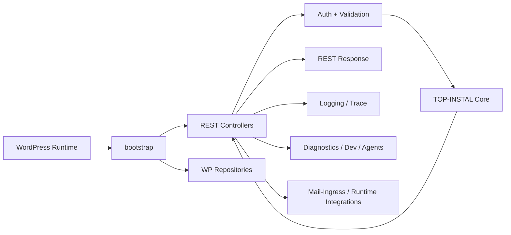

# TOP-INSTAL WP Adapter

WordPress integration and transport layer for the TOP-INSTAL HVAC calculator, exposing core functionality through WordPress-native runtime surfaces such as REST, runtime repositories, diagnostics, and operational integration hooks.

## Overview

`wp-adapter` is the boundary layer between the WordPress runtime and the TOP-INSTAL calculation core. Its job is to accept requests in WordPress-native form, validate and authorize them, translate them into core-facing inputs, call the appropriate application/domain entrypoints, and shape the result back into REST/runtime responses.

This module exists separately from `core` because WordPress concerns are operational and transport-specific: REST routing, nonce/agent-key auth, request validation, logging, diagnostics, runtime config, repository access through WordPress storage, and operational integrations such as mail-ingress or document-generation clients. Keeping these concerns here prevents WordPress details from leaking into the canonical domain engine.

The module is not the source of truth for engineering calculations, equipment selection, or pricing. Those responsibilities belong to `core`. `wp-adapter` is the runtime adapter that makes that core usable inside a WordPress plugin/application environment.

## Key Features

- WordPress REST exposure of calculator functionality
- Request validation and error normalization
- Auth integration through nonce and agent-key style runtime mechanisms
- Trace/request bootstrapping and propagation
- WordPress-specific repository adapters for policy/master data access
- Logging and operational diagnostics
- Runtime integration hooks for mail-ingress workflows
- Generator/document-related client wiring where present
- Dev/admin surfaces for smoke checks and diagnostics

## Mental Model of the System

At a high level, `wp-adapter` should be understood as:

```text
WordPress runtime
→ bootstrap/routes
→ controller
→ validation/auth
→ core use case
→ adapter response shaping
→ logs/trace/diagnostics
```

In practice:

- **Bootstrap** registers routes and wires runtime services.
- **Controllers** receive incoming HTTP requests or operational calls.
- **Validation/Auth** ensures requests are structurally valid and permitted.
- **Core Invocation** delegates business logic to `core`.
- **Response Shaping** converts core results into client-facing REST payloads.
- **Diagnostics/Logging** provide observability and operational support.

The adapter owns the WordPress-facing concerns. It does not own the business calculation itself.

## Responsibilities and Boundaries

### What `wp-adapter` owns

- WordPress route registration and runtime bootstrapping
- REST controllers and request entrypoints
- Request validation and transport-level error handling
- Auth integration for UI/runtime/agent callers
- Trace, logging, and diagnostics surfaces
- WordPress-specific repositories and config access
- Runtime integration glue for mail-ingress and document-generation flows

### What `wp-adapter` does **not** own

- Engineering calculation rules
- OZC logic
- Equipment selection source of truth
- Buffer sizing source of truth
- Pricing source of truth
- Frontend calculator UX
- Standalone document generation business logic

### Architectural boundary

`core` remains the business/source-of-truth layer.  
`wp-adapter` adapts WordPress runtime concerns into `core` contracts and responses.

That means:

- controllers should not accumulate business rules,
- repositories should not become hidden business engines,
- transport config should not dictate domain behavior,
- pricing/engineering logic should not be duplicated here.

## System Architecture

The module is organized around several runtime layers:

- **bootstrap/** — initialization, route registration, trace setup, runtime wiring
- **rest/** — request controllers, validators, REST errors, health surfaces
- **repositories/** — WordPress-backed repositories and runtime data access adapters
- **logging/** — WordPress/runtime logging abstractions
- **agents/** — health/runtime helper surfaces for integration and operator tooling
- **mail-ingress/** — workflow and integration support for ingress-driven automation
- **dev/** — smoke/admin/dev tooling

### High-level architecture



## Bootstrap and Runtime Initialization

The `bootstrap/` layer wires the adapter into the WordPress runtime.

Typical responsibilities include:

- registering REST routes,
- bootstrapping trace/request context,
- wiring document-generator related runtime hooks,
- connecting controllers/repositories/services into the plugin runtime.

Files such as:

- `bootstrap/routes.php`
- `bootstrap/trace.php`
- `bootstrap/offer-documents.php`

should be understood as initialization surfaces, not business logic surfaces.

### Why this layer matters

It keeps runtime startup concerns centralized. Without it, route registration, tracing, and integration setup would leak across the module and become harder to reason about.

## REST Layer

The `rest/` directory is the transport-facing entrypoint of the adapter.

Typical files include:

- `CalculateOfferController.php`
- `RequestValidator.php`
- `RestErrors.php`
- `AgentHealthController.php`

### Responsibilities of the REST layer

- accept incoming REST requests,
- validate payload structure,
- authenticate/authorize callers,
- delegate to `core`,
- convert results or failures into stable client-facing responses.

### What belongs here

- transport validation,
- HTTP-aware error mapping,
- request parsing,
- auth checks,
- response shaping,
- trace propagation.

### What does **not** belong here

- hidden engineering shortcuts,
- business exceptions embedded in controllers,
- pricing logic,
- policy decisions that belong in `core`.

## Repository Layer

The `repositories/` directory contains WordPress-specific adapters that expose runtime data or config in forms usable by higher layers.

Examples include:

- `BufferRulesRepositoryWp.php`
- `MasterDataRepositoryWp.php`
- `PriceBookRepositoryWp.php`
- `SelectionRulesRepositoryWp.php`

### Role of these repositories

They provide access to WordPress/runtime-backed configuration, policy, or data sources. They are infrastructure adapters.

They are **not** domain engines. Their job is to retrieve or expose data, not to redefine business rules.

### Boundary rule

If a repository starts deciding engineering outcomes on its own, the module boundary is being violated. The adapter may expose data to `core`, but domain decisions must remain in `core`.

## Logging, Tracing, and Diagnostics

This adapter includes logging and runtime diagnostics because WordPress integrations are operationally noisy and difficult to debug without explicit observability.

### Likely responsibilities in this layer

- request/trace correlation,
- runtime event logging,
- structured diagnostics for operator/debug use,
- health or agent-style probes,
- smoke/admin support during development and staging.

Directories involved include:

- `logging/`
- `agents/`
- `dev/`

### Why this matters

The adapter sits at the runtime boundary. When something fails here, the failure is often caused by config, auth, malformed requests, or integration mismatches rather than core logic itself. Good diagnostics reduce ambiguity.

## Mail-Ingress and Runtime Integrations

The presence of `mail-ingress/` indicates that `wp-adapter` also hosts runtime-facing orchestration glue for ingress-driven flows.

This is the right place for such integration code because these flows are:

- operational,
- transport-aware,
- WordPress runtime dependent,
- downstream of external integrations.

Examples of responsibilities here may include:

- generator/document client calls,
- workflow config,
- review-email/runtime integration,
- mail-ingress bridge hooks.

### Boundary note

This does not make `wp-adapter` the owner of end-to-end business logic. It simply hosts the WordPress/runtime-specific part of those workflows.

## Error Handling and Response Shaping

`wp-adapter` is responsible for converting internal failures into stable, client-facing error responses.

This includes:

- validation failures,
- auth failures,
- runtime configuration issues,
- upstream/downstream integration failures,
- properly surfaced domain errors coming from `core`.

Files like `RestErrors.php` and request validators are especially important because they help keep external behavior consistent even when internal services change.

A strong adapter should preserve:

- traceability,
- structured error codes/messages,
- clear transport/domain separation.

## Repository Structure

```text
wp-adapter/
├── bootstrap/      # route registration, trace bootstrapping, runtime wiring
├── rest/           # controllers, validation, REST error shaping, health endpoints
├── repositories/   # WordPress-backed repositories and runtime data adapters
├── logging/        # logging and trace-support code
├── agents/         # health/runtime integration support
├── mail-ingress/   # ingress-related runtime workflow integrations
└── dev/            # smoke/admin/dev tooling
```

### Directory roles

- **bootstrap/** — initializes the adapter in WordPress runtime.
- **rest/** — exposes the public/internal transport surface.
- **repositories/** — adapts WordPress data/config access for higher layers.
- **logging/** — provides observability support.
- **agents/** — supports runtime checks/integration tooling.
- **mail-ingress/** — hosts adapter-side workflow glue for ingress-based automation.
- **dev/** — contains local/operator-facing debug or smoke helpers.

## Integration with Core

`wp-adapter` sits directly in front of `core`.

The relationship is:

```text
WordPress / REST / runtime concerns
→ wp-adapter
→ core application/domain engine
```

### Relative positioning in the wider system

- **frontend calculator flow** talks to runtime surfaces ultimately exposed through `wp-adapter`
- **konfigurator** produces frontend-side choices that eventually become backend requests
- **core** owns calculation/domain logic
- **offer generator** is a downstream document system that may be reached via adapter integration code
- **mail-ingress worker** is an upstream integration source that can enter the WordPress runtime through adapter-controlled endpoints or workflows

This module exists to preserve that separation cleanly.

## Development

When changing `wp-adapter`, the safest mindset is:

- transport logic stays here,
- business logic stays in `core`,
- WordPress data access stays in repositories,
- runtime observability stays explicit.

### Safe modification guidelines

- Change controllers when request/response surfaces need adjustment.
- Change validators when transport contracts evolve.
- Change repositories when runtime data sources change.
- Change bootstrap only for routing/wiring/startup concerns.
- Avoid embedding calculation decisions in controller or repository code.
- Preserve trace/log/error propagation when adding integrations.

## Testing and Verification

Verification for adapter changes should generally include:

- request validation checks,
- REST smoke tests,
- runtime integration checks,
- transport contract checks,
- health/diagnostics verification,
- local WordPress runtime verification where appropriate.

Changes that typically require runtime verification:

- route/controller changes,
- auth changes,
- validator changes,
- error shape changes,
- mail-ingress/runtime integration wiring,
- tracing/logging initialization changes.

Changes that may be more code-only:

- logging internals,
- repository internals,
- documentation-only updates,
- isolated diagnostics helpers.

## Common Pitfalls

Common mistakes in this kind of module include:

- duplicating domain logic in controllers,
- putting engineering rules into repositories,
- weakening validation “just to make the request pass”,
- mixing runtime config with business decisions,
- breaking response/error contract consistency,
- skipping trace propagation,
- tightly coupling transport behavior to one frontend assumption,
- letting adapter code become a second hidden business layer.

## Additional Documentation

This module should ideally be read alongside broader system docs for:

- `core`
- frontend calculator flow
- configurator
- mail-ingress workflow
- offer generator integration

If local docs are limited, treat the code structure itself as the authoritative guide to the adapter’s runtime boundary.

## License

No module-specific license file is assumed here unless one exists in the actual repository. If this module is intended for public distribution, add an explicit license.
